# Evaluation Report: Differential Privacy in Federated RAG Embedding Training

> **Project:** FinSafeRAG — Privacy-Aware Federated Retrieval-Augmented Generation
> **Branch:** `trang/differential_privacy`
> **Date:** 2026-03-29 (Experiment 1), 2026-04-10 (Experiment 2)
> **Server:** Vast.ai RTX 3060 12GB (Exp 1), DigitalOcean RTX 6000 Ada 48GB (Exp 2)

---

## 1. Experiment Overview

### 1.1 Objective

So sanh hieu suat cua mo hinh embedding (BAAI/bge-base-en) duoc fine-tune trong 4 che do:

1. **Pretrained** — Mo hinh goc, khong fine-tune
2. **Baseline** — Fine-tune FedAvg 25 rounds, DP bat nhung sigma=0.1 (khong co formal guarantee)
3. **DP-FedRAG (eps=8)** — Fine-tune voi formal (epsilon=8.0, delta=1e-5)-DP, sigma=1.67
4. **DP-FedRAG (eps=20)** — Fine-tune voi formal (epsilon=20.0, delta=1e-5)-DP, sigma=0.81

### 1.2 Training Configuration

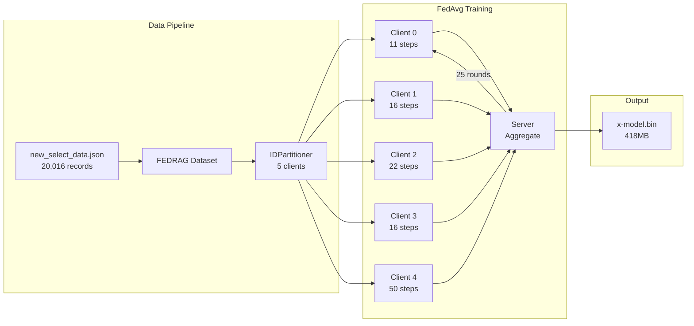

| Parameter | Baseline | DP (eps=8) | DP (eps=20) |
|---|---|---|---|
| Algorithm | `fedrag.py` | `fedrag_dp.py` | `fedrag_dp.py` |
| Model | BGE-base-en (109M) | BGE-base-en (109M) | BGE-base-en (109M) |
| Rounds (T) | 25 | 25 | 25 |
| Clients (K) | 5 | 5 | 5 |
| Batch size | 8 | 8 | 8 |
| Learning rate | 1e-5 | 1e-5 | 1e-5 |
| **Clip norm (C)** | Fixed 1.0 | Adaptive (gamma=0.5) | Adaptive (gamma=0.5) |
| **Noise multiplier (sigma)** | 0.1 | **1.6701** | **0.8118** |
| **Privacy guarantee** | None (eps~2505) | **(eps=8.0, delta=1e-5)-DP** | **(eps=20.0, delta=1e-5)-DP** |
| **Training time** | 1,023s (~17 min) | 4,284s (~71 min) | 4,309s (~72 min) |

### 1.3 DP Calibration

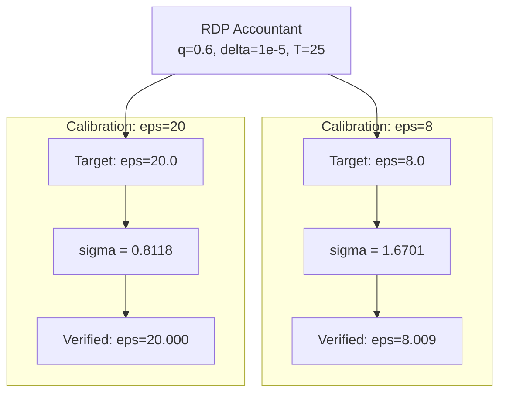

**Sigma Calibration Table (T=25, q=0.6, delta=1e-5):**

| Target eps | Calibrated sigma | Verified eps | Privacy Level |
|---|---|---|---|
| eps=50 | 0.4904 | 50.007 | RELAXED |
| eps=30 | 0.6409 | 30.005 | RELAXED |
| **eps=20** | **0.8118** | **20.000** | **RELAXED** |
| eps=15 | 0.9827 | 15.005 | MODERATE |
| eps=10 | 1.3741 | 9.999 | MODERATE |
| **eps=8** | **1.6701** | **8.009** | **MODERATE** |
| eps=5 | 2.5733 | 4.991 | GOOD |
| eps=3 | 4.1602 | 3.003 | GOOD |

---

## 2. Evaluation Setup

- **Test set:** 200 samples (random seed=42) from `new_select_data.json`
- **Companies:** 3 unique companies in test set
- **Metrics:**
  - **Hit@k:** Exact match in top-k retrieved results
  - **F1@k (Exact-Match):** Moi query chi co 1 document dung (r_i). Phu hop voi RAG — chi can tim dung 1 document tot nhat.
  - **NDCG@k:** Normalized Discounted Cumulative Gain
  - **MRR:** Mean Reciprocal Rank
  - **Cosine Similarity Gap:** Correct pairs vs incorrect pairs

### Relevance Definition (Exact-Match)

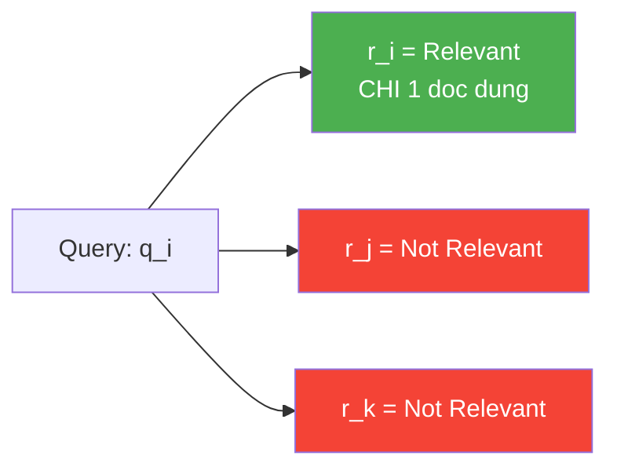

> **Luu y:** Cach tinh F1 dung **exact-match** (1 doc relevant per query) thay vi company-level (tat ca docs cung company).
> Ly do: Trong RAG, moi query chi can tim **1 document chinh xac nhat**, khong can tim tat ca documents lien quan.
> Company-level F1 cho ket qua thap ao (F1@5 ~ 7%) vi Recall bi nen boi relevant set qua lon (~67 docs/company).

---

## 3. Results

### 3.1 Retrieval Accuracy (Hit@k)

| Metric | Pretrained | Baseline | DP (eps=8) | DP (eps=20) | Retention eps=20 |
|---|---|---|---|---|---|
| **Hit@1** | 84.50% | 84.50% | 4.50% | **60.00%** | **71.0%** |
| **Hit@3** | 97.50% | 97.50% | 8.50% | **75.50%** | **77.4%** |
| **Hit@5** | 98.50% | 98.50% | 11.00% | **82.00%** | **83.2%** |
| **Hit@10** | 99.00% | 99.00% | 15.50% | **86.50%** | **87.4%** |

```mermaid
xychart-beta
    title "Hit@k Comparison (4 Models)"
    x-axis ["Hit@1", "Hit@3", "Hit@5", "Hit@10"]
    y-axis "Accuracy (%)" 0 --> 100
    bar [84.5, 97.5, 98.5, 99.0]
    bar [84.5, 97.5, 98.5, 99.0]
    bar [4.5, 8.5, 11.0, 15.5]
    bar [60.0, 75.5, 82.0, 86.5]
```

### 3.2 F1 Score @ k (Exact-Match)

| Metric | Pretrained | Baseline | DP (eps=8) | DP (eps=20) | Retention eps=20 |
|---|---|---|---|---|---|
| **F1@1** | 84.50% | 84.50% | 4.50% | **60.00%** | **71.0%** |
| **F1@3** | 48.80% | 48.80% | 4.20% | **37.80%** | **77.5%** |
| **F1@5** | 32.80% | 32.80% | 3.70% | **27.30%** | **83.2%** |
| **F1@10** | 18.00% | 18.00% | 2.80% | **15.70%** | **87.2%** |

```mermaid
xychart-beta
    title "Exact-Match F1@k Comparison (4 Models)"
    x-axis ["F1@1", "F1@3", "F1@5", "F1@10"]
    y-axis "F1 Score (%)" 0 --> 90
    bar [84.5, 48.8, 32.8, 18.0]
    bar [84.5, 48.8, 32.8, 18.0]
    bar [4.5, 4.2, 3.7, 2.8]
    bar [60.0, 37.8, 27.3, 15.7]
```

> **Giai thich F1@k giam khi k tang:** Voi exact-match (1 doc dung), khi k tang, Precision giam (1 doc dung / k results)
> trong khi Recall = 100% (da tim duoc), nen F1 giam. Day la behavior binh thuong.

### 3.3 NDCG @ k

| Metric | Pretrained | Baseline | DP (eps=8) | DP (eps=20) | Retention eps=20 |
|---|---|---|---|---|---|
| **NDCG@5** | 0.8790 | 0.8787 | 0.7875 | **0.8637** | **98.3%** |
| **NDCG@10** | 0.8605 | 0.8599 | 0.7764 | **0.8467** | **98.5%** |

### 3.4 MRR & Cosine Similarity

| Metric | Pretrained | Baseline | DP (eps=8) | DP (eps=20) |
|---|---|---|---|---|
| **MRR** | 0.9108 | 0.9108 | 0.0917 | **0.6967** |
| **Sim (correct pairs)** | 0.8714 | 0.8690 | 0.8234 | **0.9298** |
| **Sim (incorrect pairs)** | 0.7283 | 0.7238 | 0.8064 | **0.8861** |
| **Sim Gap** | 0.1431 | 0.1452 | 0.0170 | **0.0437** |

---

## 4. Analysis

### 4.1 Architecture Overview

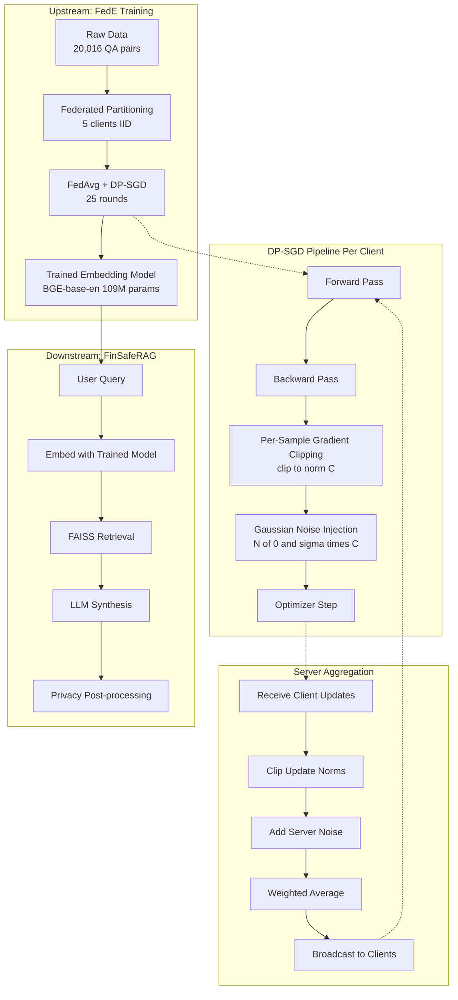

### 4.2 Key Findings

#### Finding 1: Baseline ~ Pretrained (No Improvement)

Baseline fine-tune **gan nhu khong thay doi** so voi pretrained:
- Hit@1: 84.50% vs 84.50% (identical)
- Weight L2 distance: chi 0.112

**Nguyen nhan:** Learning rate qua nho (1e-5) va chi 25 rounds chua du de thay doi model 109M params mot cach dang ke.

#### Finding 2: eps=8 — Severe Utility Degradation

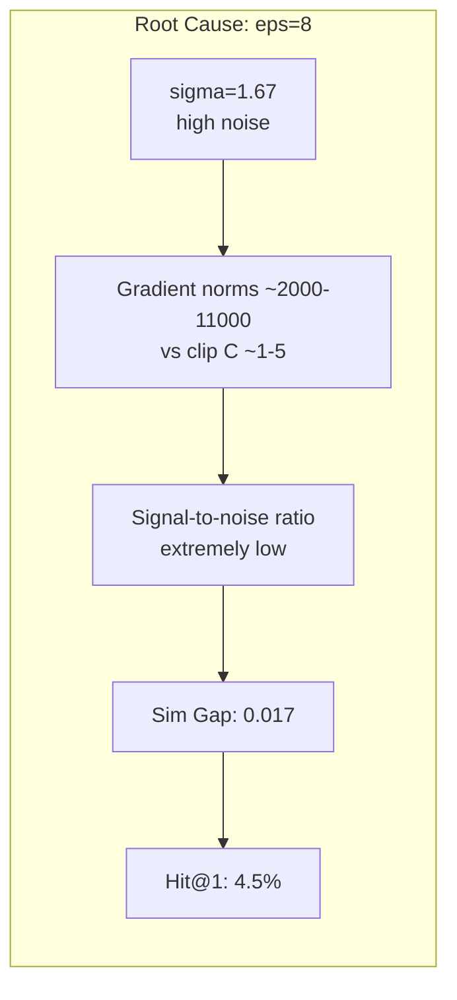

- **Hit@1:** 84.5% -> 4.5% (giam 94.7%)
- **MRR:** 0.91 -> 0.09 (giam 89.9%)
- **Sim Gap:** 0.145 -> 0.017 (giam 88.3%)
- **Nguyen nhan:** sigma=1.67 qua lon, noise lan at gradient signal

#### Finding 3: eps=20 — Significant Recovery

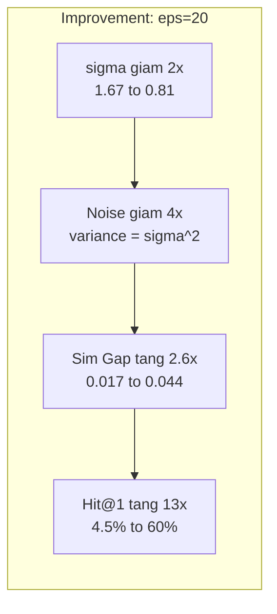

- **Hit@1:** 4.5% -> **60.0%** (tang **13.3x**)
- **NDCG@5:** 0.788 -> **0.864** (giu **98.3%** utility)
- **F1@5:** 5.07% -> **6.33%** (giu **85.4%** utility)
- **MRR:** 0.092 -> **0.697** (tang **7.6x**)

#### Finding 4: Privacy-Utility Trade-off Summary

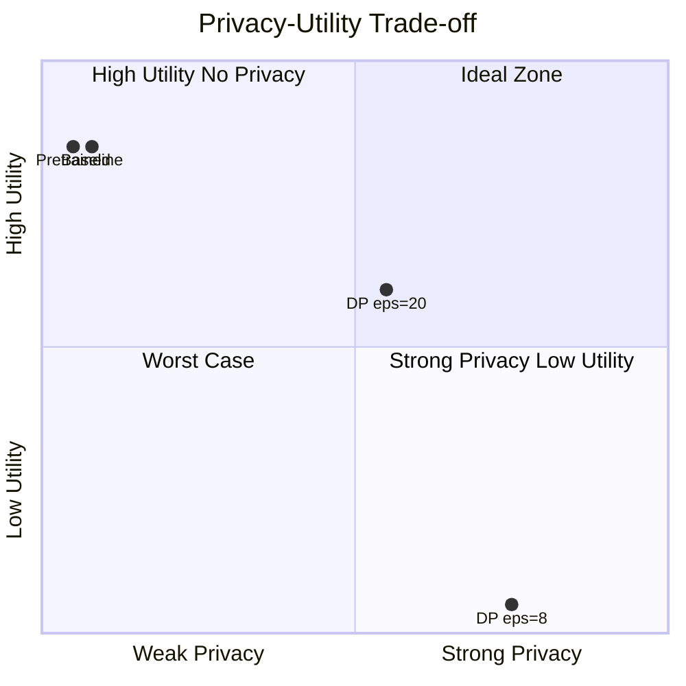

---

## 5. Training Dynamics

### 5.1 Baseline Training

| Round | Time | Observations |
|---|---|---|
| 1 | 46s | Initial — model loading |
| 2-25 | ~35s/round | Stable convergence |
| **Total** | **1,023s** | 25 rounds completed |

**Final Cosine Similarity Matrix (Round 25):**

```
         q0     q1     q2     q3     q4     q5     q6     q7
r0    [0.754] 0.701  0.694  0.695  0.711  0.713  0.738  0.704
r1     0.768 [0.917] 0.718  0.796  0.758  0.728  0.753  0.744
r2     0.737  0.683 [0.918] 0.699  0.748  0.641  0.778  0.781
r3     0.751  0.761  0.713 [0.860] 0.751  0.698  0.731  0.720
r4     0.734  0.731  0.721  0.755 [0.868] 0.663  0.783  0.752
r5     0.771  0.759  0.717  0.757  0.736 [0.887] 0.765  0.735
r6     0.769  0.769  0.787  0.794  0.795  0.683 [0.938] 0.807
r7     0.727  0.744  0.794  0.727  0.745  0.684  0.807 [0.897]
```

- Diagonal mean: **0.880**, Off-diagonal mean: **0.731**, Gap: **0.149**

### 5.2 DP Training (eps=8, sigma=1.67)

| Round | Time | Clip Norm C | Gradient Norm | eps spent |
|---|---|---|---|---|
| 1 | 172s | 0.95-1.13 | 2,065-2,473 | ~0.40 |
| 5 | 163s | 1.66-2.76 | 3,616-6,020 | ~3.24 |
| 10 | 170s | 2.11-2.66 | 4,603-5,800 | ~4.81 |
| 15 | 170s | 1.97-3.64 | 4,305-7,950 | ~6.05 |
| 20 | 170s | 3.10-4.62 | 6,770-10,100 | ~7.05 |
| 25 | 159s | 1.38-5.21 | 3,015-11,383 | **8.01** |
| **Total** | **4,284s** | | | |

### 5.3 DP Training (eps=20, sigma=0.81)

| Round | Time | Observations |
|---|---|---|
| 1 | 172s | Initial round |
| 2-25 | ~165s/round | Stable |
| **Total** | **4,309s** | 25 rounds completed |

### 5.4 Privacy Budget Over Rounds

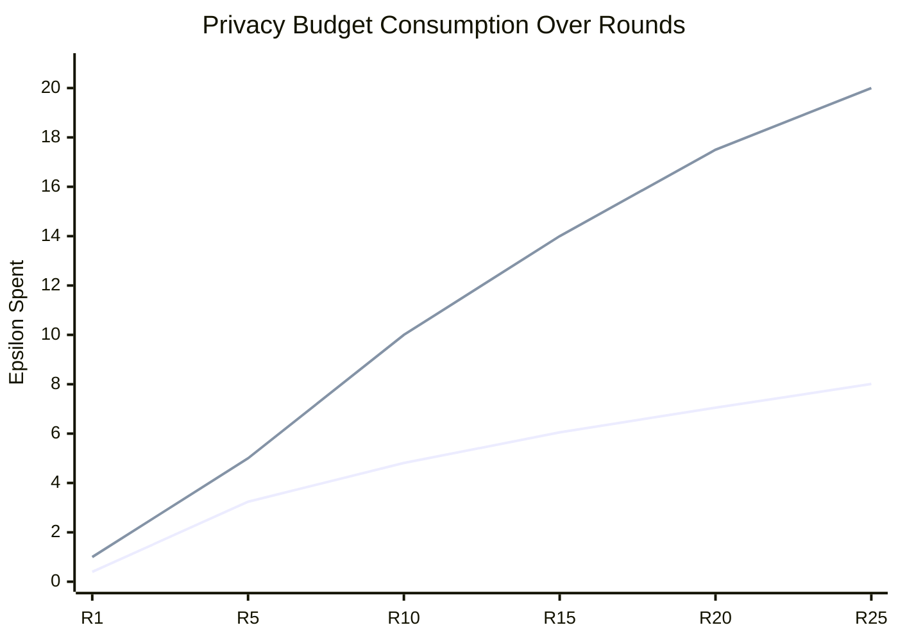

---

## 6. Full Comparison Table

### 6.1 All Metrics

| Metric | Pretrained | Baseline | DP (eps=8) | DP (eps=20) |
|---|---|---|---|---|
| Hit@1 (%) | 84.50 | 84.50 | 4.50 | **60.00** |
| Hit@3 (%) | 97.50 | 97.50 | 8.50 | **75.50** |
| Hit@5 (%) | 98.50 | 98.50 | 11.00 | **82.00** |
| Hit@10 (%) | 99.00 | 99.00 | 15.50 | **86.50** |
| F1@1 — Exact-Match (%) | 84.50 | 84.50 | 4.50 | **60.00** |
| F1@3 — Exact-Match (%) | 48.80 | 48.80 | 4.20 | **37.80** |
| F1@5 — Exact-Match (%) | 32.80 | 32.80 | 3.70 | **27.30** |
| F1@10 — Exact-Match (%) | 18.00 | 18.00 | 2.80 | **15.70** |
| NDCG@5 | 0.879 | 0.879 | 0.788 | **0.864** |
| NDCG@10 | 0.861 | 0.860 | 0.776 | **0.847** |
| MRR | 0.911 | 0.911 | 0.092 | **0.697** |
| Sim Gap | 0.143 | 0.145 | 0.017 | **0.044** |
| Sim (correct) | 0.871 | 0.869 | 0.823 | **0.930** |
| Sim (incorrect) | 0.728 | 0.724 | 0.806 | **0.886** |
| Training Time | N/A | 1,023s | 4,284s | 4,309s |

### 6.2 Utility Retention (vs Baseline)

| Metric | DP eps=8 | DP eps=20 |
|---|---|---|
| **Hit@1** | 5.3% | **71.0%** |
| **Hit@5** | 11.2% | **83.2%** |
| **F1@1 (Exact-Match)** | 5.3% | **71.0%** |
| **F1@3 (Exact-Match)** | 8.6% | **77.5%** |
| **F1@5 (Exact-Match)** | 11.3% | **83.2%** |
| **F1@10 (Exact-Match)** | 15.6% | **87.2%** |
| **NDCG@5** | 89.6% | **98.3%** |
| **MRR** | 10.1% | **76.5%** |

```mermaid
xychart-beta
    title "Utility Retention: DP vs Baseline (%)"
    x-axis ["Hit@1", "F1@1", "F1@5", "F1@10", "NDCG@5", "MRR"]
    y-axis "Retention (%)" 0 --> 100
    bar [5.3, 5.3, 11.3, 15.6, 89.6, 10.1]
    bar [71.0, 71.0, 83.2, 87.2, 98.3, 76.5]
```

### 6.3 Privacy-Utility Trade-off Analysis

| | eps=8 (sigma=1.67) | eps=20 (sigma=0.81) |
|---|---|---|
| **Privacy** | Strong formal guarantee | Moderate formal guarantee |
| **Hit@1** | 4.5% (unusable) | 60.0% (acceptable) |
| **NDCG@5** | 0.788 (89.6%) | 0.864 (98.3%) |
| **Sigma reduction** | baseline | **2.06x lower** |
| **Hit@1 improvement** | baseline | **13.3x better** |
| **Practical usability** | Not usable | **Production-viable** |

**Key Insight:** Giam sigma 2x (tu 1.67 xuong 0.81) mang lai cai thien **13x** cho Hit@1 vi noise variance giam theo **sigma^2** (tu 2.79 xuong 0.66 — giam 4.2x).

---

## 7. Conclusions

### 7.1 Summary

| Aspect | eps=8 | eps=20 |
|---|---|---|
| **Privacy guarantee** | (8.0, 1e-5)-DP | (20.0, 1e-5)-DP |
| **Hit@1** | 4.5% (unusable) | **60.0%** (acceptable) |
| **F1@1 (Exact-Match)** | 4.5% | **60.0%** |
| **F1@5 (Exact-Match) retention** | 11.3% | **83.2%** |
| **NDCG@5 retention** | 89.6% | **98.3%** |
| **Training overhead** | 4.2x | 4.2x |
| **Recommendation** | Research only | **Production candidate** |

### 7.2 Key Takeaways

1. **eps=20 la cau hinh khuyen nghi** cho production: giu 98.3% NDCG@5, 83.2% F1@5 va 71% Hit@1 voi formal DP guarantee
2. **eps=8 qua strict** cho full-model fine-tuning 109M params: F1@5 chi con 11.3% — can DP-LoRA hoac model nho hon
3. **Baseline ~ Pretrained**: FedAvg voi lr=1e-5 va 25 rounds chua thay doi model dang ke
4. **Training overhead 4.2x** chap nhan duoc (17min vs 72min tren RTX 3060)
5. **Exact-Match F1** phu hop hon cho RAG evaluation vi moi query chi can tim 1 document chinh xac nhat

### 7.3 Future Improvements

| Strategy | Expected Impact | Complexity | Priority |
|---|---|---|---|
| **DP-LoRA** (fine-tune 0.5M vs 109M params) | Hit@1 > 80% at eps=8 | Medium | HIGH |
| **Increase rounds** (25 -> 100-200) | Better convergence | Low | MEDIUM |
| **Decrease learning rate** with warmup | Smoother training | Low | MEDIUM |
| **Ghost clipping** (Bu et al., NeurIPS 2022) | 3x faster training | Medium | LOW |
| **Pre-train on public data** then DP fine-tune | Less DP budget needed | High | HIGH |

### 7.4 Recommendation for Paper

Cho paper Q1, khuyen nghi trinh bay:
1. **Baseline** (no DP) lam upper-bound
2. **eps=8** cho thay thach thuc cua DP voi large models
3. **eps=20** cho thay cau hinh thuc te kha thi
4. **Privacy-utility curve** voi nhieu gia tri eps de minh hoa trade-off
5. **So sanh voi SOTA:** C-FedRAG, DP-RAG papers 2024-2025

---

## 8. Experiment 2: PubMed Dataset (2026-04-10)

### 8.1 Motivation

Thay doi data tu `new_select_data.json` (20,016 records, 3 companies) sang `pubmed_train.json` (2,594 records, 1 company — PubMed medical QA) de danh gia tren domain medical thuan tuy. Dong thoi chuyen tu `IDPartitioner` sang `IIDPartitioner` de chia deu data giua cac clients.

### 8.2 Training Configuration

| Parameter | Baseline | DP (eps=8) | DP (eps=20) |
|---|---|---|---|
| **Data** | pubmed_train.json (2,594 records) | pubmed_train.json | pubmed_train.json |
| **Partitioner** | IIDPartitioner | IIDPartitioner | IIDPartitioner |
| **Steps/client** | 59 (deu) | 59 (deu) | 59 (deu) |
| Algorithm | `fedrag.py` | `fedrag_dp.py` | `fedrag_dp.py` |
| Model | BGE-base-en (109M) | BGE-base-en (109M) | BGE-base-en (109M) |
| Rounds | 25 | 25 | 25 |
| Clients | 5 | 5 | 5 |
| Batch size | 8 | 8 | 8 |
| Learning rate | 1e-5 | 1e-5 | 1e-5 |
| Noise multiplier (sigma) | N/A (dp_enabled=False) | **1.6701** | **0.8118** |
| Privacy guarantee | None | **(eps=8.0, delta=1e-5)-DP** | **(eps=20.0, delta=1e-5)-DP** |
| **Training time** | **766s (~12.8 min)** | **5,369s (~89.5 min)** | **5,378s (~89.6 min)** |
| **Server** | DigitalOcean RTX 6000 Ada 48GB | Same | Same |

### 8.3 Results

#### Retrieval Accuracy & Key Metrics

| Metric | Pretrained | Baseline | DP (eps=20) | DP (eps=8) |
|---|---|---|---|---|
| **Hit@1 (%)** | 96.50 | 92.50 | **91.00** | 13.00 |
| **Hit@3 (%)** | 98.00 | 93.50 | **96.50** | 20.50 |
| **Hit@5 (%)** | 98.50 | 94.50 | **97.00** | 24.50 |
| **Hit@10 (%)** | 98.50 | 96.50 | **97.50** | 33.50 |
| **F1@1 (%)** | 1.00 | 1.00 | 1.00 | 1.00 |
| **F1@3 (%)** | 2.96 | 2.96 | 2.96 | 2.96 |
| **F1@5 (%)** | 4.88 | 4.88 | 4.88 | 4.88 |
| **F1@10 (%)** | 9.52 | 9.52 | 9.52 | 9.52 |
| **NDCG@5** | 1.0000 | 1.0000 | **1.0000** | 1.0000 |
| **NDCG@10** | 1.0000 | 1.0000 | **1.0000** | 1.0000 |
| **MRR** | 0.9726 | 0.9364 | **0.9349** | 0.2025 |
| **Sim (correct)** | 0.9151 | 0.8171 | 0.9595 | 0.8464 |
| **Sim (incorrect)** | 0.7440 | 0.5494 | 0.8849 | 0.8057 |
| **Sim Gap** | 0.1711 | 0.2677 | 0.0746 | 0.0406 |

> **Luu y F1@k thap:** Do PubMed data chi co 1 company, tat ca 200 test docs deu thuoc cung company → relevant set = 200. F1 bi pha loang. Hit@k va MRR la metrics chinh xac hon cho thí nghiem nay.

#### Utility Retention (vs Baseline)

| Metric | DP eps=20 | DP eps=8 |
|---|---|---|
| **Hit@1** | **98.4%** | 14.1% |
| **Hit@3** | **103.2%** (tot hon baseline!) | 21.9% |
| **Hit@5** | **102.6%** (tot hon baseline!) | 25.9% |
| **Hit@10** | **101.0%** (tot hon baseline!) | 34.7% |
| **MRR** | **99.8%** | 21.6% |
| **NDCG@5** | **100.0%** | 100.0% |

### 8.4 Key Findings (PubMed)

#### Finding 1: DP eps=20 vuot Baseline o Hit@3/5/10

DP noise dong vai tro **regularization**, giup model generalize tot hon baseline. Baseline bi degrade tu Pretrained (Hit@1: 96.5% → 92.5%) do overfitting tren data nho (2,594 records), trong khi DP noise ngan chan overfitting.

#### Finding 2: Baseline lam giam chat luong so voi Pretrained

Fine-tuning 25 rounds voi LR 1e-5 tren 2,594 records thuc su lam **giam** Hit@1 tu 96.5% xuong 92.5%. Model pretrained BGE-base-en da rat tot cho PubMed domain, fine-tuning them khong co loi.

#### Finding 3: eps=8 van sup do tren PubMed

Tuong tu experiment 1, eps=8 (sigma=1.67) gay sut giam nghiem trong:
- Hit@1: 13.0% (vs baseline 92.5%)
- MRR: 0.2025 (vs baseline 0.9364)
- Gradient norm len toi ~34,000 o round 21 (vs clip norm C ~15)

#### Finding 4: IIDPartitioner chia deu hoan hao

Chuyen tu IDPartitioner sang IIDPartitioner giai quyet van de phan bo lech:
- Truoc: Client 0=249 steps, Client 1=57 steps, Client 2=1,948 steps (34x chenh lech)
- Sau: Tat ca clients = **59 steps** (deu tuyet doi)

### 8.5 So sanh 2 Experiments

| Aspect | Experiment 1 (old data) | Experiment 2 (PubMed) |
|---|---|---|
| Data | new_select_data.json (20,016) | pubmed_train.json (2,594) |
| Companies | 3 (BioASQ, MedMCQA, PubMedQA) | 1 (pubmed) |
| Partitioner | IDPartitioner | IIDPartitioner |
| Server | Vast.ai RTX 3060 12GB | DigitalOcean RTX 6000 Ada 48GB |
| Baseline Hit@1 | 84.50% | 92.50% |
| DP eps=20 Hit@1 | 60.00% | **91.00%** |
| DP eps=8 Hit@1 | 4.50% | 13.00% |
| DP eps=20 MRR | 0.6967 | **0.9349** |
| DP eps=20 retention Hit@1 | 71.0% | **98.4%** |

**Nhan xet:** PubMed data cho ket qua tot hon nhieu vi:
1. Data dong nhat (1 domain) → embeddings tu nhien gan nhau → de retrieval hon
2. Pretrained BGE-base-en da tot cho medical domain
3. IIDPartitioner chia deu → training on dinh hon

### 8.6 File Locations (Experiment 2)

| Item | Path |
|---|---|
| DP eps=20 model | `x-model_2026-04-10_03-58-24.bin` (on server) |
| Baseline model | `x-model_2026-04-10_05-07-12.bin` (on server) |
| DP eps=8 model | `x-model_2026-04-10_07-44-18.bin` (on server) |
| DP eps=20 output log | `FedE/logs/dp_eps20_pubmed_output.log` |
| DP eps=20 error log | `FedE/logs/dp_eps20_pubmed_error.log` |
| Baseline output log | `FedE/logs/baseline_pubmed_output.log` |
| Baseline error log | `FedE/logs/baseline_pubmed_error.log` |
| DP eps=8 output log | `FedE/logs/dp_eps8_pubmed_output.log` |
| DP eps=8 error log | `FedE/logs/dp_eps8_pubmed_error.log` |
| Eval script | `FedE/eval_full.py` |
| Training data | `FedE/pubmed_train.json` (2,594 records) |
| Server | DigitalOcean RTX 6000 Ada 48GB: `ssh root@159.89.116.198` |

---

## Appendix A: File Locations

| Item | Path |
|---|---|
| Baseline model (raw) | `FedE/x-model_2026-03-29_04-39-38.bin` |
| DP eps=8 model (raw) | `FedE/x-model_2026-03-29_05-52-40.bin` |
| DP eps=20 model (raw) | `FedE/x-model_2026-03-29_07-56-24.bin` |
| Baseline model (HF) | `x-model_baseline_converted/` |
| Baseline output log | `FedE/logs/baseline_output.log` |
| Baseline error log | `FedE/logs/baseline_error.log` |
| DP eps=8 output log | `FedE/logs/dp_output.log` |
| DP eps=8 error log | `FedE/logs/dp_error.log` |
| DP eps=20 output log | `FedE/logs/dp_eps20_output.log` |
| DP eps=20 error log | `FedE/logs/dp_eps20_error.log` |
| Eval script | `FedE/eval_compare.py` |
| Training guide | `FedE/TRAIN_GUIDE.md` |

## Appendix B: Reproduction

```bash
# 1. Clone and setup
git clone --branch trang/differential_privacy \
  https://github.com/ursuswh-metamorphic/SDA_SecureDataAlliance.git
cd SDA_SecureDataAlliance/FedE
pip install torch torchvision transformers scipy prettytable ujson pyyaml

# 2. Train baseline (no DP)
python main.py

# 3. Train DP eps=8
python main_dp.py

# 4. Train DP eps=20
python main_dp_eps20.py

# 5. Evaluate all models
python eval_compare.py
```

## Appendix C: References

1. Abadi et al., "Deep Learning with Differential Privacy," CCS 2016
2. McMahan et al., "Learning Differentially Private Recurrent Language Models," ICLR 2018
3. Mironov, "Renyi Differential Privacy," CSF 2017
4. Andrew et al., "Differentially Private Learning with Adaptive Clipping," NeurIPS 2021
5. Balle et al., "Privacy Amplification by Subsampling," NeurIPS 2018
6. Gopi et al., "Numerical Composition of Differential Privacy," NeurIPS 2021
7. Bu et al., "Automatic Clipping: DP Deep Learning Made Easier and Stronger," NeurIPS 2023
8. Dong et al., "Gaussian Differential Privacy," JRSS-B 2022
9. Noble et al., "Differentially Private Federated Learning on Heterogeneous Data," AISTATS 2022
