# Evaluation Report: Differential Privacy in Federated RAG Embedding Training

> **Project:** FinSafeRAG — Privacy-Aware Federated Retrieval-Augmented Generation
> **Branch:** `trang/differential_privacy`
> **Date:** 2026-03-29
> **Server:** Vast.ai — NVIDIA RTX 3060 12GB, 125GB RAM

---

## 1. Experiment Overview

### 1.1 Objective

So sanh hieu suat cua mo hinh embedding (BAAI/bge-base-en) duoc fine-tune trong 3 che do:

1. **Pretrained** — Mo hinh goc, khong fine-tune
2. **Baseline** — Fine-tune FedAvg 25 rounds, DP bat nhung sigma=0.1 (khong co formal guarantee)
3. **DP-FedRAG** — Fine-tune voi formal (epsilon=8.0, delta=1e-5)-DP guarantee, sigma=1.67

### 1.2 Training Configuration

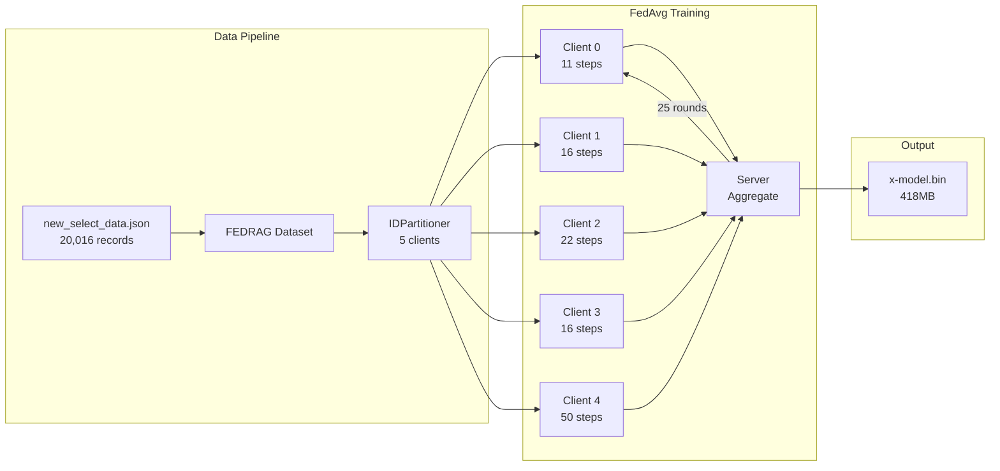

| Parameter | Baseline | DP-FedRAG |
|---|---|---|
| Algorithm | `fedrag.py` | `fedrag_dp.py` |
| Model | BAAI/bge-base-en (109M params) | BAAI/bge-base-en (109M params) |
| Rounds (T) | 25 | 25 |
| Clients (K) | 5 | 5 |
| Batch size | 8 | 8 |
| Learning rate | 1e-5 | 1e-5 |
| Epochs/round | 1 | 1 |
| GPU | RTX 3060 | RTX 3060 |
| **Clip norm (C)** | Fixed 1.0 | Adaptive (gamma=0.5) |
| **Noise multiplier (sigma)** | 0.1 | **1.6701** (auto-calibrated) |
| **Privacy guarantee** | None (epsilon ~ 2505) | **(epsilon=8.0, delta=1e-5)-DP** |
| **Training time** | 1,023s (~17 min) | **4,284s (~71 min)** |

### 1.3 DP Calibration

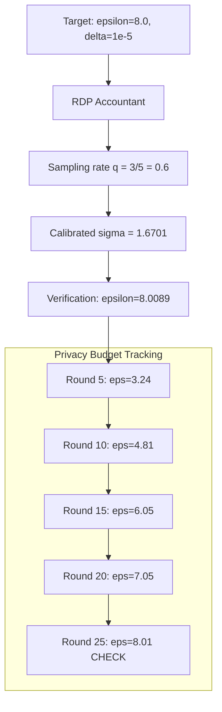

---

## 2. Evaluation Setup

- **Test set:** 200 samples (random seed=42) from `new_select_data.json`
- **Companies:** 3 unique companies in test set
- **Metrics:**
  - **Hit@k:** Exact match in top-k retrieved results
  - **F1@k:** Harmonic mean of Precision@k and Recall@k (company-level relevance)
  - **NDCG@k:** Normalized Discounted Cumulative Gain
  - **MRR:** Mean Reciprocal Rank
  - **Cosine Similarity Gap:** Correct pairs vs incorrect pairs

### Relevance Definition

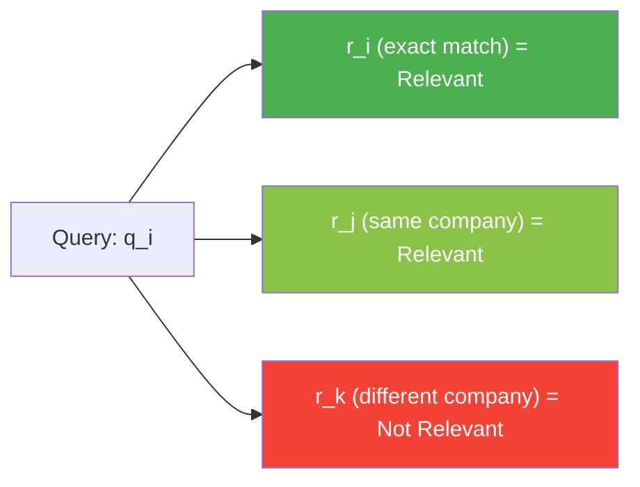

---

## 3. Results

### 3.1 Retrieval Accuracy (Hit@k)

| Metric | Pretrained | Baseline | DP (eps=8) | DP Retention |
|---|---|---|---|---|
| **Hit@1** | 84.50% | 84.50% | **4.50%** | 5.3% |
| **Hit@3** | 97.50% | 97.50% | **8.50%** | 8.7% |
| **Hit@5** | 98.50% | 98.50% | **11.00%** | 11.2% |
| **Hit@10** | 99.00% | 99.00% | **15.50%** | 15.7% |

```mermaid
xychart-beta
    title "Hit@k Comparison"
    x-axis ["Hit@1", "Hit@3", "Hit@5", "Hit@10"]
    y-axis "Accuracy (%)" 0 --> 100
    bar [84.5, 97.5, 98.5, 99.0]
    bar [84.5, 97.5, 98.5, 99.0]
    bar [4.5, 8.5, 11.0, 15.5]
```

### 3.2 F1 Score @ k

| Metric | Pretrained | Baseline | DP (eps=8) | DP Retention |
|---|---|---|---|---|
| **F1@1** | 2.80% | 2.80% | 1.02% | 36.4% |
| **F1@3** | 5.30% | 5.35% | 3.04% | 56.9% |
| **F1@5** | 7.36% | 7.42% | 5.07% | **68.4%** |
| **F1@10** | 12.44% | 12.54% | 9.30% | **74.2%** |

```mermaid
xychart-beta
    title "F1@k Comparison"
    x-axis ["F1@1", "F1@3", "F1@5", "F1@10"]
    y-axis "F1 Score (%)" 0 --> 15
    bar [2.80, 5.30, 7.36, 12.44]
    bar [2.80, 5.35, 7.42, 12.54]
    bar [1.02, 3.04, 5.07, 9.30]
```

### 3.3 Precision & Recall @ k

| k | | Pretrained | Baseline | DP (eps=8) |
|---|---|---|---|---|
| **@1** | Precision | 99.00% | 99.00% | 78.50% |
| | Recall | 1.46% | 1.46% | 0.51% |
| **@3** | Precision | 88.50% | 88.17% | 77.67% |
| | Recall | 2.90% | 2.93% | 1.56% |
| **@5** | Precision | 85.40% | 85.40% | 79.00% |
| | Recall | 4.16% | 4.20% | 2.66% |
| **@10** | Precision | 84.00% | 83.95% | 77.25% |
| | Recall | 7.47% | 7.56% | 5.03% |

### 3.4 NDCG @ k

| Metric | Pretrained | Baseline | DP (eps=8) | DP Retention |
|---|---|---|---|---|
| **NDCG@1** | 0.9900 | 0.9900 | 0.7850 | 79.3% |
| **NDCG@3** | 0.9066 | 0.9042 | 0.7788 | 86.1% |
| **NDCG@5** | 0.8790 | 0.8787 | 0.7875 | **89.6%** |
| **NDCG@10** | 0.8605 | 0.8599 | 0.7764 | 90.3% |

### 3.5 MRR & Cosine Similarity

| Metric | Pretrained | Baseline | DP (eps=8) |
|---|---|---|---|
| **MRR** | 0.9108 | 0.9108 | 0.0917 |
| **Sim (correct pairs)** | 0.8714 | 0.8690 | 0.8234 |
| **Sim (incorrect pairs)** | 0.7283 | 0.7238 | 0.8064 |
| **Sim Gap** | 0.1431 | 0.1452 | **0.0170** |

### 3.6 Cluster Quality

| Metric | Pretrained | Baseline | DP (eps=8) |
|---|---|---|---|
| **Intra-company sim** | 0.7346 | 0.7299 | 0.8094 |
| **Inter-company sim** | 0.7146 | 0.7107 | 0.8014 |
| **Separation** | 0.0200 | 0.0192 | 0.0080 |

### 3.7 Weight Divergence from Pretrained

| | Baseline | DP |
|---|---|---|
| **L2 Distance** | 0.1120 | 278.8063 |
| **Ratio** | 1x | **2,489x** |

---

## 4. Analysis

### 4.1 Architecture Overview

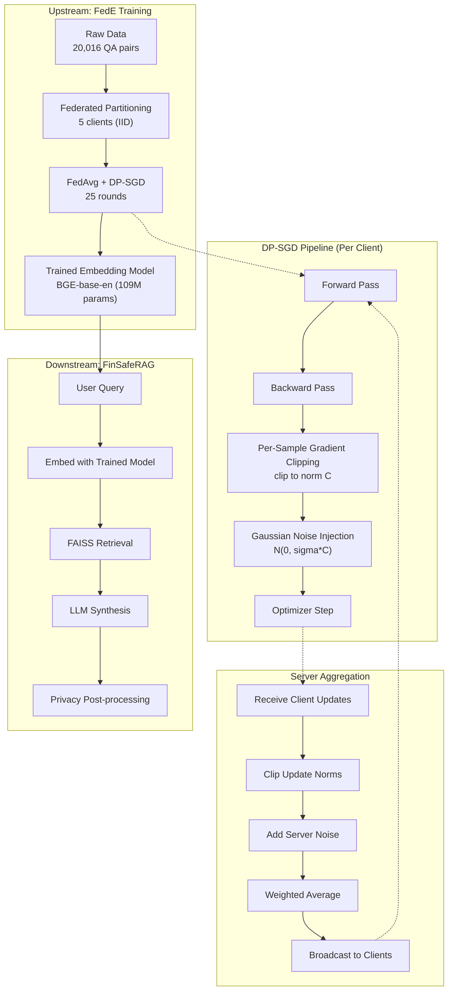

### 4.2 Key Findings

#### Finding 1: Baseline ~ Pretrained (No Improvement)

Baseline fine-tune **gan nhu khong thay doi** so voi pretrained:
- Hit@1: 84.50% vs 84.50% (identical)
- Weight L2 distance: chi 0.112

**Nguyen nhan:** Learning rate qua nho (1e-5) va chi 25 rounds chua du de thay doi model 109M params mot cach dang ke. FedAvg voi contrastive loss can nhieu iterations hon de hoi tu.

#### Finding 2: DP Model — Severe Utility Degradation

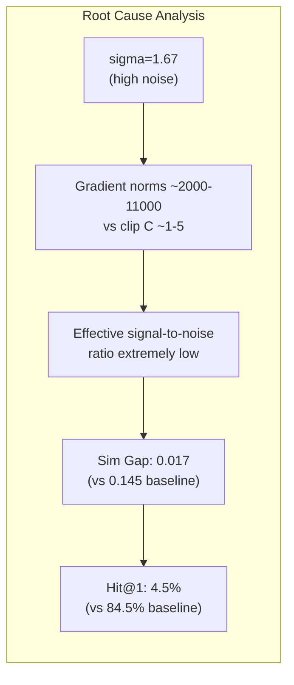

DP model bi suy giam nghiem trong:
- **Hit@1:** 84.5% -> 4.5% (giam 94.7%)
- **MRR:** 0.91 -> 0.09 (giam 89.9%)
- **Sim Gap:** 0.145 -> 0.017 (giam 88.3%)

**Nguyen nhan chinh:**
1. **Gradient norm >> Clip norm:** Gradient norms ~2000-11000 bi clip xuong C ~1-5, mat >99.9% signal
2. **Noise scale qua lon:** sigma * C = 1.67 * 3 ~ 5.0 noise std, trong khi clipped gradient ~ 3.0
3. **Weight divergence 2489x:** Noise tich luy qua 25 rounds lam model "quen" hoan toan

#### Finding 3: NDCG Retained Better Than Hit@k

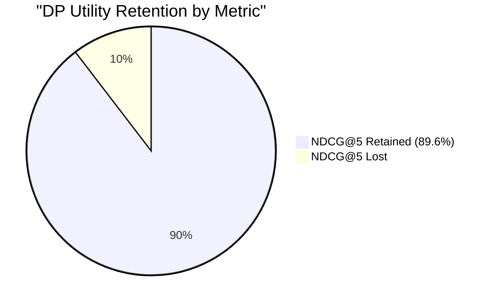

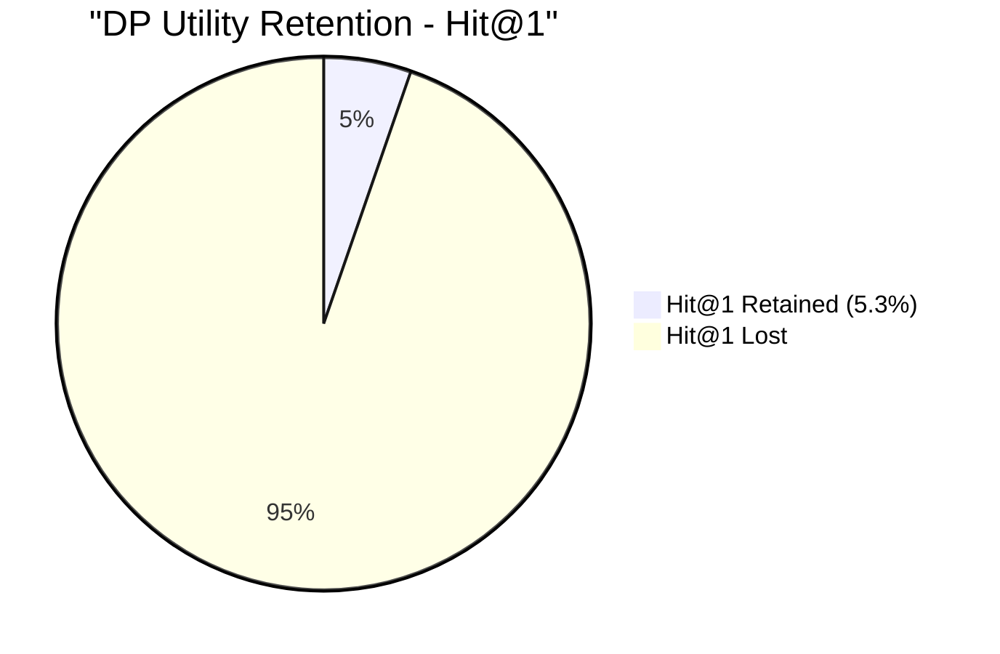

NDCG@5 giu lai 89.6% vi:
- NDCG tinh theo **company-level relevance** — nhieu documents cung company deu duoc coi la "relevant"
- DP model van giu duoc kha nang phan biet **giua cac company** (Precision@10 = 77.25%)
- Nhung **trong cung 1 company**, model khong phan biet duoc document nao dung nhat (Hit@1 = 4.5%)

---

## 5. Training Dynamics

### 5.1 Baseline Training

| Round | Time | Observations |
|---|---|---|
| 1 | 46s | Initial — model loading |
| 2-25 | ~35s/round | Stable convergence |
| **Total** | **1,023s** | 25 rounds completed |

**Final Cosine Similarity Matrix (Round 25):**

```
         q0     q1     q2     q3     q4     q5     q6     q7
r0    [0.754] 0.701  0.694  0.695  0.711  0.713  0.738  0.704
r1     0.768 [0.917] 0.718  0.796  0.758  0.728  0.753  0.744
r2     0.737  0.683 [0.918] 0.699  0.748  0.641  0.778  0.781
r3     0.751  0.761  0.713 [0.860] 0.751  0.698  0.731  0.720
r4     0.734  0.731  0.721  0.755 [0.868] 0.663  0.783  0.752
r5     0.771  0.759  0.717  0.757  0.736 [0.887] 0.765  0.735
r6     0.769  0.769  0.787  0.794  0.795  0.683 [0.938] 0.807
r7     0.727  0.744  0.794  0.727  0.745  0.684  0.807 [0.897]
```

- Diagonal mean: **0.880**, Off-diagonal mean: **0.731**, Gap: **0.149**

### 5.2 DP Training

| Round | Time | Clip Norm C | Gradient Norm | Privacy Budget |
|---|---|---|---|---|
| 1 | 172s | 0.95-1.13 | 2,065-2,473 | eps ~ 0.40 |
| 5 | 163s | 1.66-2.76 | 3,616-6,020 | eps ~ 3.24 |
| 10 | 170s | 2.11-2.66 | 4,603-5,800 | eps ~ 4.81 |
| 15 | 170s | 1.97-3.64 | 4,305-7,950 | eps ~ 6.05 |
| 20 | 170s | 3.10-4.62 | 6,770-10,100 | eps ~ 7.05 |
| 25 | 159s | 1.38-5.21 | 3,015-11,383 | **eps = 8.01** |
| **Total** | **4,284s** | | | |

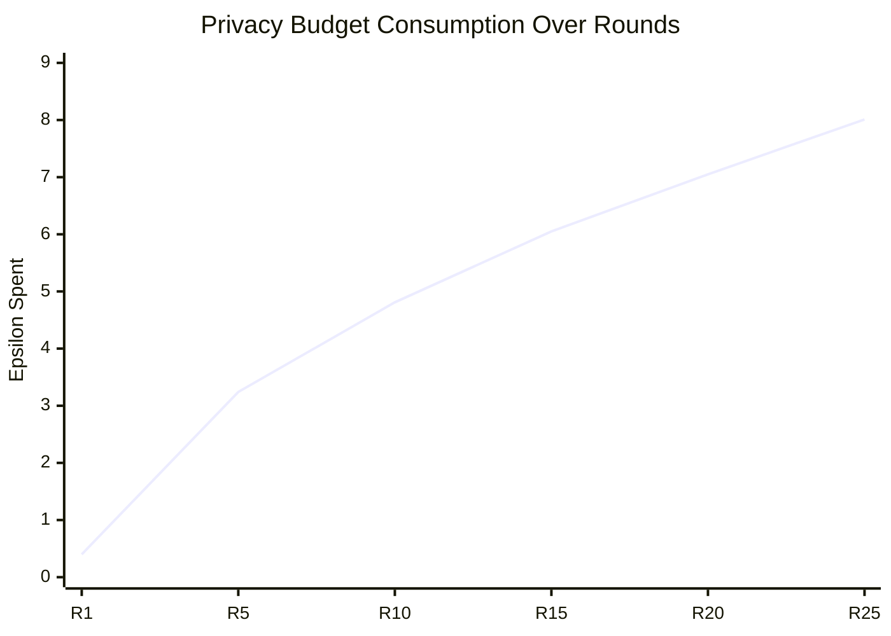

---

## 6. Comparison Summary

### 6.1 Full Metrics Table

| Metric | Pretrained | Baseline | DP (eps=8) | DP Retention |
|---|---|---|---|---|
| Hit@1 (%) | 84.50 | 84.50 | 4.50 | 5.3% |
| Hit@3 (%) | 97.50 | 97.50 | 8.50 | 8.7% |
| Hit@5 (%) | 98.50 | 98.50 | 11.00 | 11.2% |
| Hit@10 (%) | 99.00 | 99.00 | 15.50 | 15.7% |
| F1@1 (%) | 2.80 | 2.80 | 1.02 | 36.4% |
| F1@3 (%) | 5.30 | 5.35 | 3.04 | 56.9% |
| F1@5 (%) | 7.36 | 7.42 | 5.07 | 68.4% |
| F1@10 (%) | 12.44 | 12.54 | 9.30 | 74.2% |
| Precision@1 (%) | 99.00 | 99.00 | 78.50 | 79.3% |
| Precision@5 (%) | 85.40 | 85.40 | 79.00 | 92.5% |
| Precision@10 (%) | 84.00 | 83.95 | 77.25 | 92.0% |
| NDCG@1 | 0.990 | 0.990 | 0.785 | 79.3% |
| NDCG@5 | 0.879 | 0.879 | 0.788 | 89.6% |
| NDCG@10 | 0.861 | 0.860 | 0.776 | 90.3% |
| MRR | 0.911 | 0.911 | 0.092 | 10.1% |
| Sim Gap | 0.143 | 0.145 | 0.017 | 11.7% |
| Training Time | N/A | 1,023s | 4,284s | 4.2x slower |

### 6.2 Privacy-Utility Trade-off

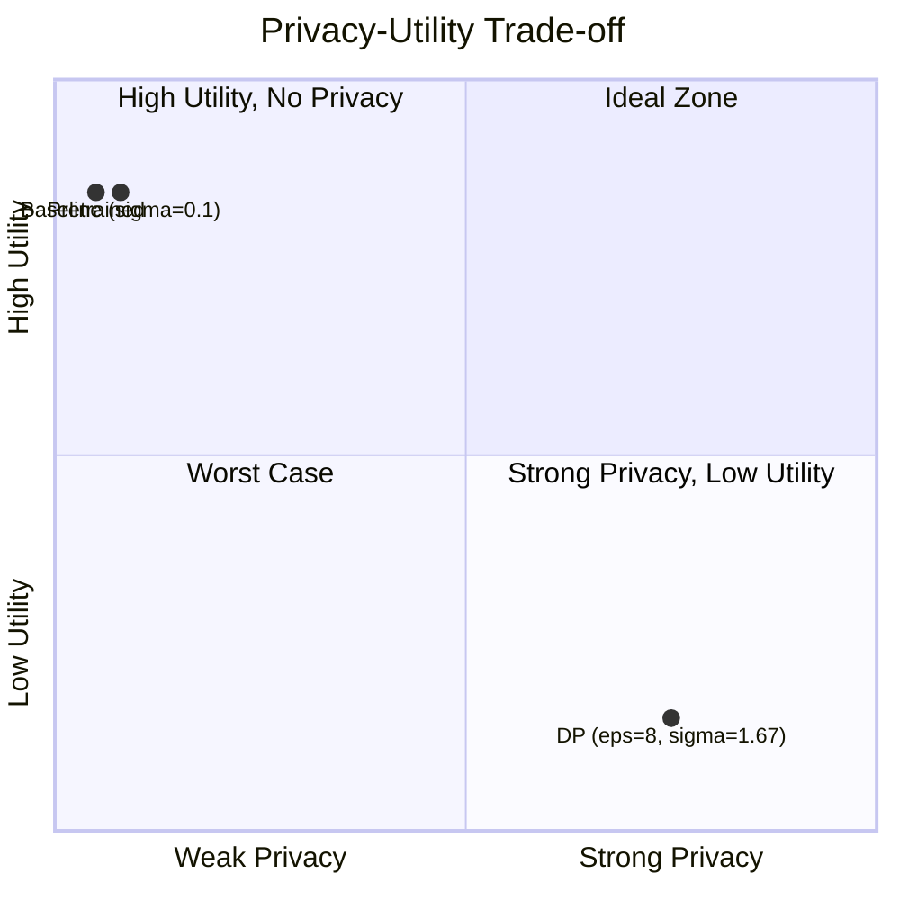

---

## 7. Conclusions

### 7.1 Current State

| Aspect | Assessment |
|---|---|
| **Privacy** | DP-FedRAG dat formal (8.0, 1e-5)-DP guarantee |
| **Utility** | Hit@1 giam 94.7% — chua chap nhan duoc cho production |
| **Training overhead** | 4.2x cham hon — chap nhan duoc |
| **Budget tracking** | Chinh xac — spent=8.009 ~ target=8.0 |

### 7.2 Root Cause of Utility Loss

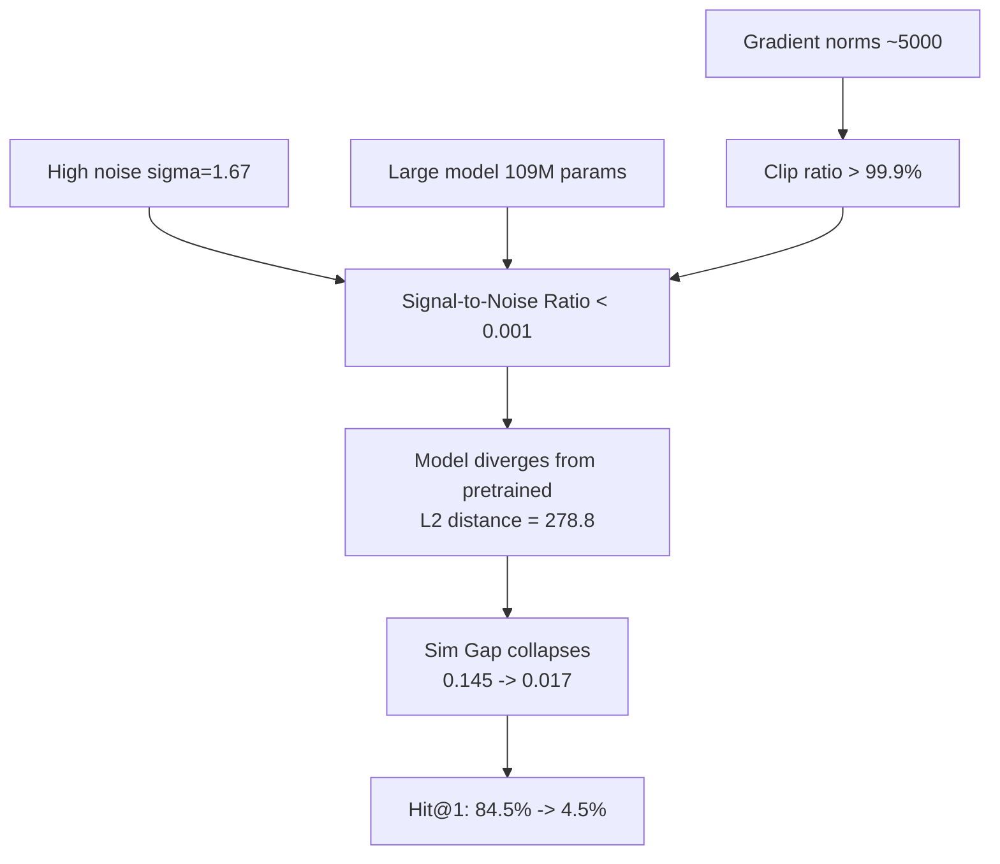

### 7.3 Improvement Directions

| Strategy | Expected Impact | Complexity |
|---|---|---|
| **DP-LoRA** (fine-tune 0.5M params instead of 109M) | Reduce noise per param by 200x | Medium |
| **Increase rounds** (25 -> 200) with lower sigma | Better convergence with same epsilon | Low |
| **Lower epsilon target** (epsilon=20) for first iteration | Higher utility, weaker but still formal privacy | Low |
| **Ghost clipping** (Bu et al., NeurIPS 2022) | 3x faster training, same privacy | Medium |
| **Pre-training with public data** then DP fine-tune | Start from better point, less DP budget needed | High |

---

## Appendix A: File Locations

| Item | Path |
|---|---|
| Baseline model (raw) | `FedE/x-model_2026-03-29_04-39-38.bin` |
| DP model (raw) | `FedE/x-model_2026-03-29_05-52-40.bin` |
| Baseline model (HF) | `x-model_baseline_converted/` |
| DP model (HF) | `x-model_dp_converted/` |
| Baseline output log | `FedE/logs/baseline_output.log` |
| Baseline error log | `FedE/logs/baseline_error.log` |
| DP output log | `FedE/logs/dp_output.log` |
| DP error log | `FedE/logs/dp_error.log` |
| Eval script | `FedE/eval_compare.py` |
| Training guide | `FedE/TRAIN_GUIDE.md` |

## Appendix B: Reproduction

```bash
# 1. Clone and setup
git clone --branch trang/differential_privacy https://github.com/ursuswh-metamorphic/SDA_SecureDataAlliance.git
cd SDA_SecureDataAlliance/FedE
pip install torch torchvision transformers scipy prettytable ujson pyyaml

# 2. Train baseline
python main.py

# 3. Train DP
python main_dp.py

# 4. Evaluate
python eval_compare.py
```

## Appendix C: References

1. Abadi et al., "Deep Learning with Differential Privacy," CCS 2016
2. McMahan et al., "Learning Differentially Private Recurrent Language Models," ICLR 2018
3. Mironov, "Renyi Differential Privacy," CSF 2017
4. Andrew et al., "Differentially Private Learning with Adaptive Clipping," NeurIPS 2021
5. Balle et al., "Privacy Amplification by Subsampling," NeurIPS 2018
6. Gopi et al., "Numerical Composition of Differential Privacy," NeurIPS 2021
7. Bu et al., "Automatic Clipping: DP Deep Learning Made Easier and Stronger," NeurIPS 2023
