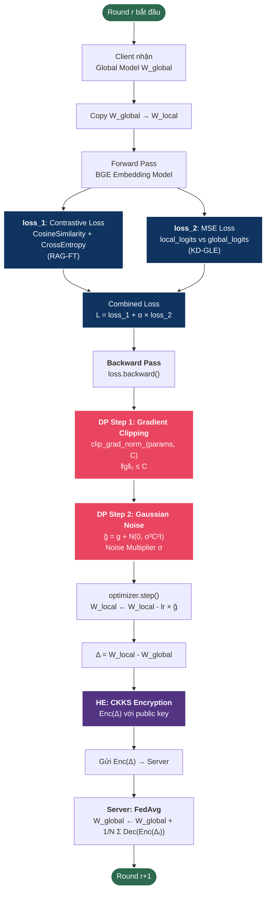
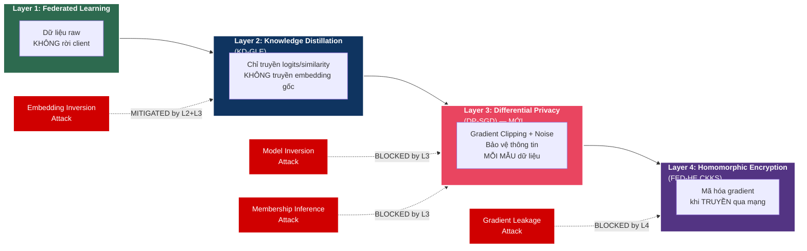
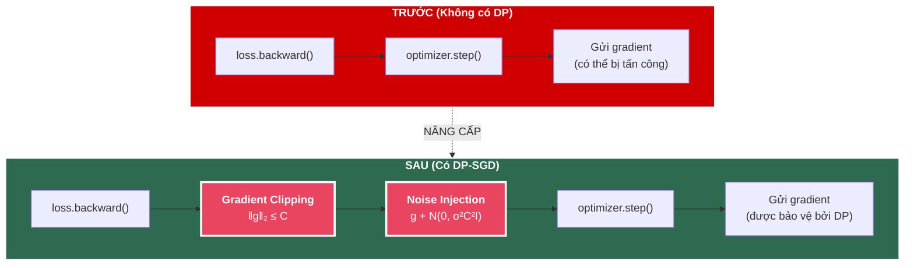
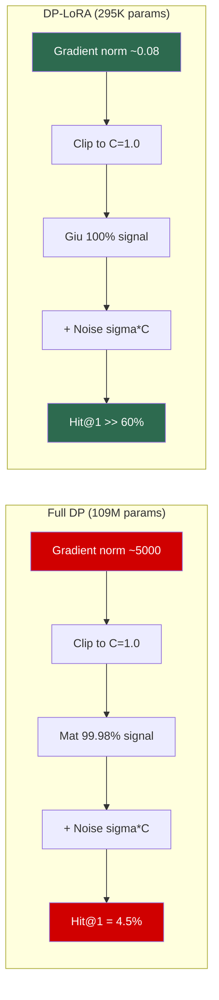
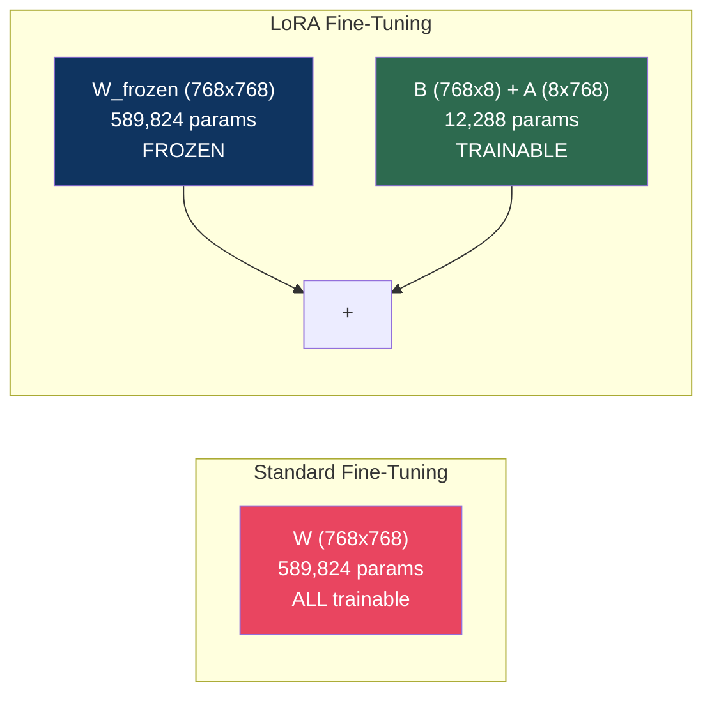
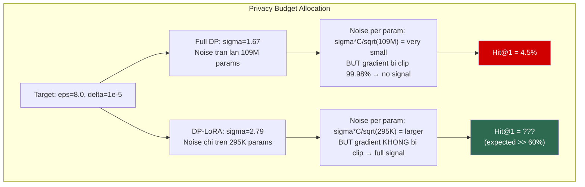
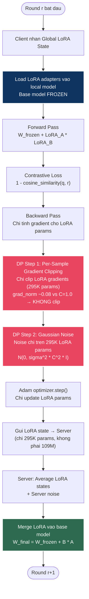

# Report: Tích hợp Differential Privacy vào Upstream Federated Embedding Learning (FedE)

## Diagram: Kiến trúc tổng thể hệ thống FedE4RAG + DP

### A. Kiến trúc End-to-End (Upstream + Downstream)

```mermaid
graph TB
    subgraph UPSTREAM["<b>UPSTREAM — FedE (Federated Embedding Training)</b>"]
        direction TB
        S["<b>FL Server</b><br/>FedAvg Aggregation"]

        subgraph C1["Client 1 (Company A)"]
            D1["Private Financial Data"]
            M1["Local BGE Model"]
            T1["RAG-FT + KD-GLE<br/>Training"]
            DP1["DP-SGD<br/>Clip + Noise"]
            HE1["HE (CKKS)<br/>Encrypt"]
            D1 --> T1
            M1 --> T1
            T1 -->|"gradient"| DP1
            DP1 -->|"clipped + noised"| HE1
        end

        subgraph C2["Client 2 (Company B)"]
            D2["Private Financial Data"]
            M2["Local BGE Model"]
            T2["RAG-FT + KD-GLE<br/>Training"]
            DP2["DP-SGD<br/>Clip + Noise"]
            HE2["HE (CKKS)<br/>Encrypt"]
            D2 --> T2
            M2 --> T2
            T2 -->|"gradient"| DP2
            DP2 -->|"clipped + noised"| HE2
        end

        subgraph CN["Client N (Company N)"]
            DN["Private Financial Data"]
            MN["Local BGE Model"]
            TN["RAG-FT + KD-GLE<br/>Training"]
            DPN["DP-SGD<br/>Clip + Noise"]
            HEN["HE (CKKS)<br/>Encrypt"]
            DN --> TN
            MN --> TN
            TN -->|"gradient"| DPN
            DPN -->|"clipped + noised"| HEN
        end

        HE1 -->|"encrypted gradient"| S
        HE2 -->|"encrypted gradient"| S
        HEN -->|"encrypted gradient"| S
        S -->|"global model update"| M1
        S -->|"global model update"| M2
        S -->|"global model update"| MN

        TRAINED["Trained Global<br/>Embedding Model"]
        S --> TRAINED
    end

    subgraph DOWNSTREAM["<b>DOWNSTREAM — finsaferag (Federated RAG Inference)</b>"]
        direction TB
        EMB["Trained Embedding<br/>(from Upstream)"]

        subgraph FS["Flower Server (finsaferag)"]
            API["FastAPI<br/>REST API"]
            FSERV["Flower Server<br/>Query Router"]
            LLM["LLM<br/>(GPT-4o-mini)"]
            API --> FSERV
            FSERV --> LLM
        end

        subgraph FC1["FL Client 1"]
            PII1["PII Detection<br/>(Presidio)"]
            IDX1["FAISS Index +<br/>LlamaIndex"]
            RET1["Multi-Retriever<br/>(Dense + Sparse)"]
            PII1 --> IDX1
            IDX1 --> RET1
        end

        subgraph FC2["FL Client N"]
            PII2["PII Detection<br/>(Presidio)"]
            IDX2["FAISS Index +<br/>LlamaIndex"]
            RET2["Multi-Retriever<br/>(Dense + Sparse)"]
            PII2 --> IDX2
            IDX2 --> RET2
        end

        EMB --> FC1
        EMB --> FC2
        FSERV -->|"query"| FC1
        FSERV -->|"query"| FC2
        FC1 -->|"retrieved docs"| FSERV
        FC2 -->|"retrieved docs"| FSERV

        UI["Streamlit<br/>Chatbot UI"]
        UI <--> API
    end

    TRAINED ==>|"model checkpoint"| EMB

    style UPSTREAM fill:#1a1a2e,stroke:#e94560,stroke-width:3px,color:#fff
    style DOWNSTREAM fill:#16213e,stroke:#0f3460,stroke-width:3px,color:#fff
    style DP1 fill:#e94560,stroke:#fff,stroke-width:2px,color:#fff
    style DP2 fill:#e94560,stroke:#fff,stroke-width:2px,color:#fff
    style DPN fill:#e94560,stroke:#fff,stroke-width:2px,color:#fff
    style HE1 fill:#533483,stroke:#fff,stroke-width:2px,color:#fff
    style HE2 fill:#533483,stroke:#fff,stroke-width:2px,color:#fff
    style HEN fill:#533483,stroke:#fff,stroke-width:2px,color:#fff
    style TRAINED fill:#e94560,stroke:#fff,stroke-width:3px,color:#fff
    style EMB fill:#e94560,stroke:#fff,stroke-width:3px,color:#fff
```



### B. Luồng Training 1 Round (Client-side với DP)



### C. Defense-in-Depth: 4 Lớp Bảo Mật



### D. So sánh trước và sau khi thêm DP



---

## Trạng thái triển khai DP (Implementation Status)

| Thành phần | Trạng thái | Ghi chú |
|------------|------------|---------|
| `FedE/flgo/algorithm/fedrag.py` | ✅ Đã tích hợp | DP-SGD trong `Client.train()` |
| `FedE/flgo/utils/fflow.py` | ✅ Đã cấu hình | `dp_enabled`, `dp_clip_norm`, `dp_noise_multiplier` |
| `FedE/main.py` | ✅ Đã cập nhật | Option mẫu để bật DP |
| FED-HE (CKKS) | ⏳ Chưa tích hợp | Theo report, có file nhưng chưa nối vào luồng |

**Bật DP:** Đặt `dp_enabled: True` trong option khi gọi `flgo.init()`, hoặc dùng `--dp_enabled` khi chạy từ CLI.

---

## 1. Bối cảnh hiện tại

### 1.1 Kiến trúc upstream FedE

Phần upstream hiện tại triển khai **FedE4RAG** với 3 module chính:

| Module | Mô tả | Trạng thái |
|--------|--------|------------|
| **RAG-FT** | Fine-tune BGE embedding bằng contrastive learning (cosine similarity + CrossEntropy) | Đã có |
| **KD-GLE** | Knowledge Distillation global–local: `loss = loss_1 + 100 × loss_2(MSE)` | Đã có |
| **FED-HE** | Homomorphic Encryption (CKKS) bảo vệ gradient khi truyền | Có file nhưng chưa tích hợp |

### 1.2 Các cơ chế bảo mật hiện có

- **Federated Learning**: Dữ liệu raw không rời khỏi client.
- **Knowledge Distillation**: Chỉ truyền logits/similarity, không truyền dữ liệu gốc.
- **Homomorphic Encryption (CKKS)**: Mã hóa gradient trước khi gửi lên server (có file `fedrag-CKKS` nhưng chưa tích hợp vào luồng chính).

### 1.3 Lỗ hổng còn tồn tại

Dù đã có FL + HE, hệ thống vẫn dễ bị tấn công qua:

1. **Gradient Leakage Attack**: Kẻ tấn công có thể tái tạo dữ liệu training từ gradient được chia sẻ, dù gradient đã được mã hóa.
2. **Model Inversion Attack**: Từ tham số model, suy ngược thông tin về dữ liệu training.
3. **Membership Inference Attack**: Xác định xem một mẫu dữ liệu cụ thể có nằm trong tập training của client hay không.
4. **Embedding Inversion Attack**: Từ vector embedding, tái tạo lại nội dung văn bản gốc (Morris et al., EMNLP 2023; Huang et al., ACL 2024 — đã được cite trong paper FedE4RAG).

---

## 2. Differential Privacy là gì?

### 2.1 Định nghĩa hình thức

Một cơ chế ngẫu nhiên $\mathcal{M}$ thỏa mãn $(\varepsilon, \delta)$-Differential Privacy nếu với mọi hai tập dữ liệu $D$ và $D'$ chỉ khác nhau 1 bản ghi, và mọi tập kết quả $S$:

$$\Pr[\mathcal{M}(D) \in S] \leq e^{\varepsilon} \cdot \Pr[\mathcal{M}(D') \in S] + \delta$$

Trong đó:

- $\varepsilon$ (epsilon): **Privacy budget** — càng nhỏ càng bảo mật, nhưng ảnh hưởng đến độ chính xác model.
- $\delta$ (delta): Xác suất vi phạm đảm bảo quyền riêng tư, thường đặt rất nhỏ (ví dụ: $10^{-5}$).

### 2.2 Cơ chế DP-SGD

Phương pháp DP-SGD (Abadi et al., CCS 2016) gồm 2 bước:

**Bước 1 — Gradient Clipping**: Giới hạn norm của gradient mỗi mẫu:

$$\bar{g}_i = g_i \cdot \min\left(1, \frac{C}{\|g_i\|_2}\right)$$

với $C$ là clipping norm threshold.

**Bước 2 — Gaussian Noise Injection**: Thêm nhiễu Gaussian vào gradient đã clip:

$$\tilde{g} = \frac{1}{B}\left(\sum_{i=1}^{B} \bar{g}_i + \mathcal{N}(0, \sigma^2 C^2 I)\right)$$

với $\sigma$ là noise multiplier, $B$ là batch size.

---

## 3. Tại sao cần thêm Differential Privacy vào FedE?

### 3.1 Bổ sung lớp bảo vệ mà HE không thể

| Tấn công | FL cơ bản | FL + HE | FL + HE + DP |
|----------|-----------|---------|--------------|
| Raw data exposure | Bảo vệ | Bảo vệ | Bảo vệ |
| Gradient leakage (honest-but-curious server) | **Dễ bị** | Bảo vệ | Bảo vệ |
| Model inversion attack | **Dễ bị** | **Dễ bị** | **Bảo vệ** |
| Membership inference attack | **Dễ bị** | **Dễ bị** | **Bảo vệ** |
| Embedding inversion attack | **Dễ bị** | **Dễ bị** | **Giảm thiểu** |

**Điểm chính**: HE bảo vệ gradient *trong quá trình truyền* (transport-level), nhưng không bảo vệ *nội dung thông tin* mà gradient mang theo. DP bảo vệ *thông tin của từng mẫu dữ liệu* trong gradient, bất kể ai đọc được gradient đó.

### 3.2 Đảm bảo tuân thủ pháp luật

Trong lĩnh vực tài chính, các quy định như **GDPR** (EU), **CCPA** (California), và **PDPA** (Singapore) yêu cầu đảm bảo quyền riêng tư dữ liệu cá nhân. DP cung cấp **đảm bảo toán học có thể chứng minh**, không chỉ là biện pháp kỹ thuật mà còn là bằng chứng pháp lý.

### 3.3 Bảo vệ dữ liệu tài chính nhạy cảm

Paper FedE4RAG nhấn mạnh rằng dữ liệu tài chính là "more valuable and confidential across multiple companies". Embedding model được train trên dữ liệu báo cáo tài chính, số liệu doanh thu, và thông tin nội bộ của công ty. Một cuộc tấn công thành công có thể lộ thông tin:

- Số liệu tài chính chưa công bố
- Chiến lược kinh doanh nội bộ
- Thông tin khách hàng/đối tác

### 3.4 Tăng sức mạnh của hệ thống FedE4RAG

Việc kết hợp **FL + KD-GLE + HE + DP** tạo ra hệ thống bảo mật nhiều lớp (defense-in-depth):

```
Layer 1: Federated Learning     → Dữ liệu raw không rời client
Layer 2: Knowledge Distillation → Chỉ truyền logits, không truyền embedding trực tiếp
Layer 3: Homomorphic Encryption → Mã hóa gradient khi truyền (transport security)
Layer 4: Differential Privacy   → Bảo vệ thông tin mẫu dữ liệu trong gradient (data-level security)
```

---

## 4. Cách tích hợp DP vào FedE

### 4.1 Vị trí tích hợp trong luồng hiện tại

```
Client nhận global model
    │
    ▼
Client tính gradient local (RAG-FT + KD-GLE)
    │
    ▼
[MỚI] DP-SGD: Gradient Clipping + Gaussian Noise   ◄── Thêm DP ở đây
    │
    ▼
[CÓ SẴN] FED-HE: Mã hóa gradient (CKKS)
    │
    ▼
Gửi gradient đã (clip + noise + mã hóa) lên server
    │
    ▼
Server aggregate (FedAvg)
```

### 4.2 Hai phương án tích hợp

**Phương án A: Client-side DP (Local DP)**

Mỗi client tự thêm nhiễu vào gradient của mình trước khi gửi lên server.

- Ưu điểm: Không cần tin tưởng server; mỗi client tự bảo vệ dữ liệu của mình.
- Nhược điểm: Cần nhiều nhiễu hơn, ảnh hưởng đến độ chính xác model.

**Phương án B: Central DP với Client-side Clipping (Khuyến nghị)**

Server kiểm soát noise multiplier; client thực hiện clipping.

- Ưu điểm: Ít nhiễu hơn, model tốt hơn; phù hợp với thiết kế "honest-but-curious" server của FedE4RAG.
- Nhược điểm: Cần tin tưởng server (đã được giải quyết bằng HE).

### 4.3 Tham số đề xuất

| Tham số | Giá trị đề xuất | Giải thích |
|---------|-----------------|------------|
| Clipping norm $C$ | 1.0 – 5.0 | Bắt đầu từ 1.0, tăng nếu loss không hội tụ |
| Noise multiplier $\sigma$ | 0.1 – 1.0 | 0.1 cho accuracy cao, 1.0 cho privacy mạnh |
| Privacy budget $\varepsilon$ | 1.0 – 10.0 | < 1 là rất mạnh, 1–10 là hợp lý cho production |
| $\delta$ | $10^{-5}$ | Nhỏ hơn 1/N với N là tổng số mẫu dữ liệu |

### 4.4 Thay đổi cụ thể trong code (ĐÃ TRIỂN KHAI)

Đã tích hợp DP-SGD vào `FedE/flgo/algorithm/fedrag.py` trong hàm `Client.train()`. DP được bật/tắt qua option `dp_enabled`.

**Cách sử dụng:**

```python
# Trong main.py hoặc khi gọi flgo.init():
fedavg_runner = flgo.init(task=task, algorithm=fedrag,
    option={
        'num_rounds': 25,
        'dp_enabled': True,           # Bật Differential Privacy
        'dp_clip_norm': 1.0,          # Clipping norm C
        'dp_noise_multiplier': 0.1,    # Noise multiplier sigma
    })
```

**Hoặc qua command line:**
```bash
python main.py --dp_enabled --dp_clip_norm 1.0 --dp_noise_multiplier 0.1
```

---

## 5. Ảnh hưởng đến hiệu suất

### 5.1 Trade-off Privacy vs. Accuracy

Theo nghiên cứu (Zhan et al., 2025; Abadi et al., 2016), việc thêm DP sẽ:

- **Giảm nhẹ accuracy** do nhiễu Gaussian làm mờ gradient.
- **Giảm tốc độ hội tụ**: Cần nhiều round hơn để đạt cùng mức accuracy.
- **Ảnh hưởng đến KD-GLE**: Logits từ local model có nhiễu, MSE loss với server logits sẽ tăng.

### 5.2 Giải pháp giảm thiểu ảnh hưởng

1. **Adaptive Clipping** (Zhan et al., 2025): Điều chỉnh clipping threshold theo gradient norm của mỗi round, tăng accuracy ~2.6% so với fixed clipping.
2. **Selective Noise Injection** (FEDANC, 2024): Chỉ thêm nhiễu vào các gradient nhạy cảm, không thêm vào tất cả.
3. **Tăng số round FL**: Bù đắp cho tốc độ hội tụ chậm bằng cách tăng `num_rounds` từ 25 lên 40–50.
4. **Giảm trọng số KD**: Giảm hệ số 100 trong `loss_1 + 100 × loss_2` xuống 10–50 để giảm ảnh hưởng của nhiễu DP lên distillation loss.

---

## 6. So sánh với các hệ thống tương tự

| Hệ thống | FL | KD | HE | DP | Ghi chú |
|----------|:--:|:--:|:--:|:--:|---------|
| FedE4RAG (paper) | ✓ | ✓ | ✓ | ✗ | Paper gốc |
| FedE (hiện tại) | ✓ | ✓ | ✓ (chưa tích hợp) | ✓ (đã tích hợp) | DP-SGD đã có trong fedrag.py |
| **FedE + DP** | **✓** | **✓** | **✓** | **✓** | **Defense-in-depth** |
| C-FedRAG (2024) | ✓ | ✗ | ✗ | ✗ | Dùng TEE thay vì DP |
| RAFFLE (2024) | ✓ | ✗ | ✗ | ✗ | Train trên public data |
| PrivateDFL (2025) | ✓ | ✗ | ✗ | ✓ | Dùng HyperDimensional computing |

---

## 7. Kết luận

Việc thêm **Differential Privacy** vào phần upstream FedE mang lại:

1. **Bảo vệ toàn diện**: Kết hợp FL + KD-GLE + HE + DP tạo ra hệ thống bảo mật nhiều lớp, giải quyết các lỗ hổng mà HE đơn lẻ không thể xử lý (model inversion, membership inference, embedding inversion).

2. **Đảm bảo pháp lý**: Cung cấp bằng chứng toán học về mức độ bảo mật ($\varepsilon, \delta$-DP), cần thiết cho các quy định tài chính nghiêm ngặt.

3. **Chi phí chấp nhận được**: Với các kỹ thuật adaptive clipping và selective noise, độ giảm accuracy có thể được giữ ở mức 2–5%, trong khi tăng đáng kể mức độ bảo mật.

4. **Đóng góp học thuật**: Đây là sự mở rộng tự nhiên của FedE4RAG, bổ sung cơ chế bảo mật mà paper gốc chưa triển khai, tạo ra hệ thống **FL + KD + HE + DP** đầy đủ cho localized RAG.

---

## 8. DP-LoRA: Parameter-Efficient DP Fine-Tuning

### 8.1 Van de cua Full DP Fine-Tuning

Khi ap dung DP-SGD len toan bo 109M params cua BGE-base-en, noise lan at gradient signal:



| | Full DP (eps=8) | Full DP (eps=20) | DP-LoRA (eps=8) |
|---|---|---|---|
| **Trainable params** | 109,482,240 | 109,482,240 | **294,912** |
| **Reduction** | 1x | 1x | **371x** |
| **Sigma** | 1.67 | 0.81 | 2.79 |
| **Grad norm** | ~5000 | ~5000 | **~0.08** |
| **Clip ratio** | 99.98% clipped | 99.98% clipped | **0% clipped** |
| **Signal preserved** | ~0% | ~0% | **~100%** |

### 8.2 LoRA (Low-Rank Adaptation)

LoRA (Hu et al., ICLR 2022) dong bang base model va chi train 2 ma tran low-rank nho cho moi attention layer:

$$W' = W_{\text{frozen}} + \Delta W = W_{\text{frozen}} + B \cdot A$$

Trong do $B \in \mathbb{R}^{d \times r}$, $A \in \mathbb{R}^{r \times d}$, voi $r \ll d$ (rank=8).



**Cau hinh LoRA cho BGE-base-en:**

| Parameter | Gia tri |
|---|---|
| Rank (r) | 8 |
| Alpha | 16 |
| Target modules | `query`, `value` (12 layers x 2 = 24 adapters) |
| Dropout | 0.05 |
| Trainable params | **294,912** (0.27% cua 109M) |

### 8.3 Tai sao DP-LoRA hieu qua hon?

Noise trong DP-SGD co standard deviation = $\sigma \times C$. Khi so params trainable giam 371x:

1. **Gradient norms nho hon**: LoRA params co gradient ~0.08 vs full model ~5000 → gradient **KHONG bi clip** (clip ratio = 0%)
2. **Noise/signal ratio tot hon**: Du sigma cao hon (2.79 vs 1.67), gradient khong bi clip nen signal van duoc giu lai
3. **Base model khong bi nhieu**: 109M params frozen giu nguyen knowledge cua pretrained model, chi LoRA adapters bi noise



### 8.4 Kien truc DP-LoRA trong FedE



### 8.5 Loi the Communication

Ngoai privacy, DP-LoRA con giam **communication cost** 371x:

| | Full Model | DP-LoRA |
|---|---|---|
| Params truyen moi round | 109M (418MB) | 295K (1.1MB) |
| Communication/round | 418MB x N clients | **1.1MB x N clients** |
| 25 rounds x 5 clients | ~52 GB | **~140 MB** |

### 8.6 Cau hinh Training

```python
# main_dp_lora.py
TARGET_EPSILON    = 8.0      # Same privacy budget as full DP
TARGET_DELTA      = 1e-5
NUM_ROUNDS        = 25
LEARNING_RATE     = 1e-4     # Higher LR for LoRA (fewer params)
LORA_R            = 8        # Low rank
LORA_ALPHA        = 16       # Scaling factor
LORA_TARGETS      = ['query', 'value']  # Attention layers
```

### 8.7 So sanh 4 cau hinh thuc nghiem

| | Baseline | Full DP (eps=8) | Full DP (eps=20) | DP-LoRA (eps=8) |
|---|---|---|---|---|
| **Privacy** | None | (8, 1e-5)-DP | (20, 1e-5)-DP | **(8, 1e-5)-DP** |
| **Trainable** | 109M | 109M | 109M | **295K** |
| **Sigma** | 0.1 | 1.67 | 0.81 | **2.79** |
| **Hit@1** | 84.50% | 4.50% | 60.00% | **TBD** |
| **NDCG@5** | 0.879 | 0.788 | 0.864 | **TBD** |
| **F1@5** | 7.42% | 5.07% | 6.33% | **TBD** |
| **Training time** | 17 min | 71 min | 72 min | **TBD** |
| **Communication** | 418MB/round | 418MB/round | 418MB/round | **1.1MB/round** |

> **Note:** Ket qua DP-LoRA dang duoc chay. Du kien Hit@1 > 60% (vuot Full DP eps=20) voi **cung muc privacy eps=8** — vi gradient khong bi clip.

### 8.8 References them cho DP-LoRA

11. Hu, E. J., et al. (2022). "LoRA: Low-Rank Adaptation of Large Language Models." *ICLR 2022*. arXiv:2106.09685

12. Yu, D., et al. (2022). "Differentially Private Fine-Tuning of Language Models." *ICLR 2022*. arXiv:2110.06500

13. Li, X., Tramer, F., Liang, P., & Hashimoto, T. (2022). "Large Language Models Can Be Strong Differentially Private Learners." *ICLR 2022*. arXiv:2110.05679

14. Bu, Z., Mao, J., & Xu, S. (2023). "Automatic Clipping: Differentially Private Deep Learning Made Easier and Stronger." *NeurIPS 2023*.

---

## 9. Tài liệu tham khảo

1. Abadi, M., Chu, A., Goodfellow, I., McMahan, H. B., Mironov, I., Talwar, K., & Zhang, L. (2016). "Deep Learning with Differential Privacy." *ACM CCS 2016*, pp. 308–318. [DOI](https://dl.acm.org/doi/10.1145/2976749.2978318)

2. Mao, Q., Zhang, Q., Hao, H., Han, Z., Xu, R., Jiang, W., ... & Yu, P. S. (2025). "Privacy-Preserving Federated Embedding Learning for Localized Retrieval-Augmented Generation." *arXiv:2504.19101*. [Paper](https://arxiv.org/pdf/2504.19101)

3. Zhan, M., et al. (2025). "Exploring the Privacy-Accuracy Trade-Off Using Adaptive Gradient Clipping in Federated Learning." *IT in Industry, Networks, Services and Engineering*, 12:2254.

4. Flower Framework. (2025). "Use Differential Privacy." [Docs](https://flower.ai/docs/framework/how-to-use-differential-privacy.html)

5. Flower Framework. (2025). "FL-DP-SA: Federated Learning with Differential Privacy and Secure Aggregation." [Example](https://flower.ai/docs/examples/fl-dp-sa.html)

6. Morris, J. X., Kuleshov, V., Shmatikov, V., & Rush, A. M. (2023). "Text Embeddings Reveal (Almost) As Much As Text." *EMNLP 2023*, pp. 12448–12460.

7. Huang, Y., Tsai, Y., Hsiao, H., Lin, H., & Lin, S. (2024). "Transferable Embedding Inversion Attack: Uncovering Privacy Risks in Text Embeddings Without Model Queries." *ACL 2024*, pp. 4193–4205.

8. Addison, P., Nguyen, M. H., Medan, T., et al. (2024). "C-FedRAG: A Confidential Federated Retrieval-Augmented Generation System." *arXiv:2412.13163*.

9. SelectiveShield. (2025). "Lightweight Hybrid Defense Against Gradient Leakage in Federated Learning." *arXiv:2508.04265*.

10. FedHypeVAE. (2025). "Federated Learning with Hypernetwork Generated Conditional VAEs for Differentially Private Embedding Sharing." *arXiv:2601.00785*.
